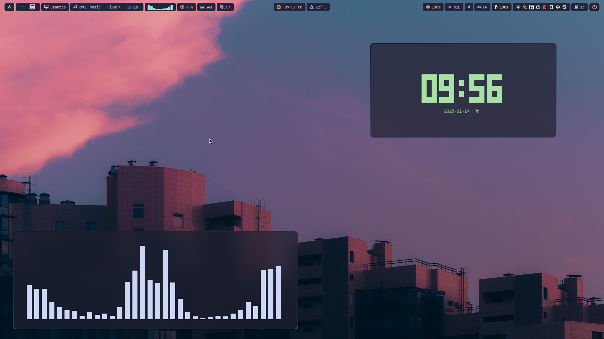

# 🐱 Kirisaki_VK's catppuccin dotfiles
This dotfile is based on prasanthrangan's dotfiles [hyprdots](https://github.com/prasanthrangan/hyprdots) 



## Installation
First install all the dependencies for this setup. All the dependencies for this config will be listed [here](dependencies.lst)

If your're using an arch based distro with yay installed, you can run the following comand to install all the required dependencies:
```bash
$ yay -S $(cat dependencies.lst | sed "s/#.*//g" | grep "\w")
```


Just clone this repo and copy the `.config` directory into your home directory.
```bash
$ cp -r .config ~/
```
>❗**WARNING**❗: Doing so will overwrite your old config so always do a backup of your config directory before doing anything

Catppuccin theme installation instaruction will come soon ...

all screenshoots will be found at the [screenshot folder](screenshots/)